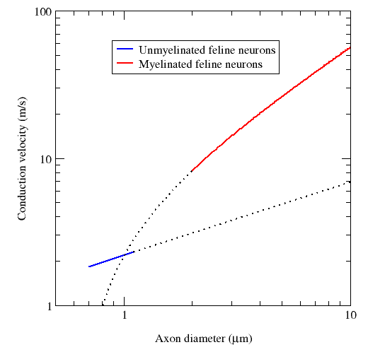

The speed of action potentials inside neurons is comparable to those of motorized two wheelers. The slowest of action potential lies in the range of 30-40 Km/hr while the fastest one is in the range of 400-500 Km/hr. The faster neurons are most likely to be mylienated. This cool figure from Wiki depicts the propagation speed of action potential.   \[caption id="" align="alignnone" width="520"\] Propagation speed of action potential in neurons (From Wiki).\[/caption\]
